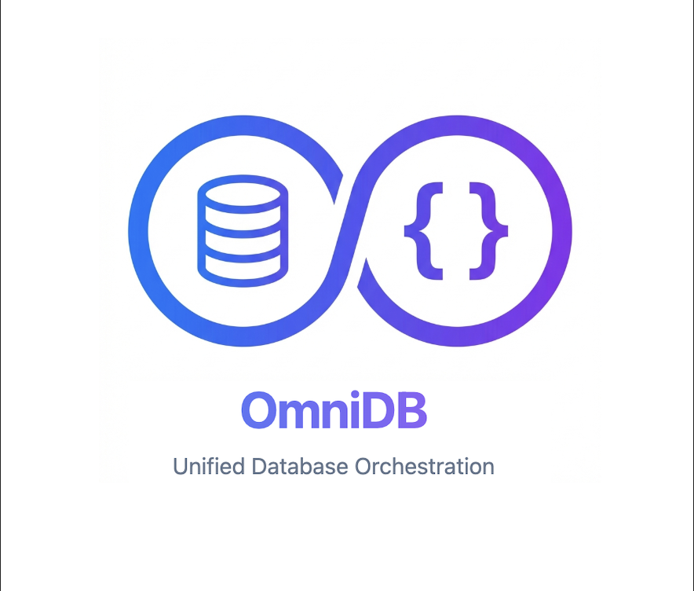

<p align="center">
  
</p>

# OmniDB

> Thin database orchestration library for Node.js — manage multiple connections with health monitoring and failover.

[](https://opensource.org/licenses/MIT)
[](https://nodejs.org)
[](https://github.com/sathvikc/omni-db)
[](https://github.com/sathvikc/omni-db)

## Features

- 🔌 **Multi-Database Support** — Bring your own clients (Prisma, Drizzle, Redis, MongoDB, etc.)
- 🏥 **Health Monitoring** — Configurable periodic health checks with timeouts
- 🔄 **Automatic Failover** — Route to backups when primary is unhealthy
- 📡 **Event System** — Subscribe to connection, health, and failover events
- 📦 **Minimal Footprint** — Zero runtime dependencies, <10KB bundle
- 🔷 **TypeScript Ready** — Full type definitions with generics

## Before & After

<details>
<summary><strong>❌ Without OmniDB</strong> — 80+ lines of boilerplate</summary>

```javascript
// DIY: Managing multiple databases with health checks and failover

const primaryPool = new Pool({ connectionString: PRIMARY_URL });
const replicaPool = new Pool({ connectionString: REPLICA_URL });
const redis = createClient({ url: REDIS_URL });

let primaryHealthy = true;
let replicaHealthy = true;
let redisHealthy = true;

// Manual health check loop
setInterval(async () => {
  try {
    await primaryPool.query('SELECT 1');
    primaryHealthy = true;
  } catch {
    primaryHealthy = false;
    console.log('[HEALTH] Primary unhealthy');
  }
  
  try {
    await replicaPool.query('SELECT 1');
    replicaHealthy = true;
  } catch {
    replicaHealthy = false;
  }
  
  try {
    await redis.ping();
    redisHealthy = true;
  } catch {
    redisHealthy = false;
  }
}, 30000);

// Manual failover logic
function getDatabase() {
  if (primaryHealthy) return primaryPool;
  if (replicaHealthy) {
    console.log('[FAILOVER] Using replica');
    return replicaPool;
  }
  throw new Error('All databases unavailable');
}

// Manual graceful shutdown
process.on('SIGTERM', async () => {
  clearInterval(healthCheckInterval);
  await Promise.all([
    primaryPool.end(),
    replicaPool.end(),
    redis.quit(),
  ]);
  process.exit(0);
});

// Usage
app.get('/users', async (req, res) => {
  const db = getDatabase();
  const { rows } = await db.query('SELECT * FROM users');
  res.json(rows);
});
```

</details>

<details open>
<summary><strong>✅ With OmniDB</strong> — 20 lines, zero boilerplate</summary>

```javascript
import { Orchestrator } from 'omni-db';

const db = new Orchestrator({
  connections: { primary: primaryPool, replica: replicaPool, cache: redis },
  failover: { primary: 'replica' },
  healthCheck: {
    interval: '30s',
    checks: {
      primary: async (c) => { await c.query('SELECT 1'); return true; },
      replica: async (c) => { await c.query('SELECT 1'); return true; },
      cache: async (c) => (await c.ping()) === 'PONG',
    },
  },
});

await db.connect();
db.shutdownOnSignal();

// Usage — identical, but with automatic failover
app.get('/users', async (req, res) => {
  const pg = db.get('primary');  // Auto-routes to replica if primary is down
  const { rows } = await pg.query('SELECT * FROM users');
  res.json(rows);
});
```

</details>

**What you get:** Health monitoring, automatic failover, event system, graceful shutdown, TypeScript types — all in <10KB with zero dependencies.

## Installation

```bash
npm install omni-db
```

## Quick Start

```javascript
import { Orchestrator } from 'omni-db';

const db = new Orchestrator({
  connections: {
    primary: prismaClient,
    replica: replicaClient,
    cache: redisClient,
  },
  failover: { primary: 'replica' },
  healthCheck: {
    interval: '30s',
    timeout: '5s',
    checks: {
      primary: async (client) => {
        await client.$queryRaw`SELECT 1`;
        return true;
      },
      cache: async (client) => {
        const pong = await client.ping();
        return pong === 'PONG';
      },
    },
  },
});

// Connect and start health monitoring
await db.connect();

// Get clients (auto-routes to replica if primary is unhealthy)
const client = db.get('primary');

// Check health status
console.log(db.health());
// { primary: { status: 'healthy' }, replica: { status: 'healthy' }, cache: { status: 'healthy' } }

// Disconnect when done
await db.disconnect();
```

## API Reference

### `new Orchestrator(config)`

Creates a new orchestrator instance.

| Option | Type | Description |
|--------|------|-------------|
| `connections` | `Record<string, any>` | Named database client instances |
| `failover` | `Record<string, string>` | Map primary → backup names |
| `healthCheck.interval` | `string` | Check interval (e.g., `'30s'`, `'1m'`) |
| `healthCheck.timeout` | `string` | Timeout per check |
| `healthCheck.retry.retries` | `number` | Failed attempts before marking unhealthy |
| `healthCheck.retry.delay` | `string` | Waiting time between retries |
| `healthCheck.checks` | `Record<string, Function>` | Custom health check functions |

### Methods

| Method | Returns | Description |
|--------|---------|-------------|
| `connect()` | `Promise<void>` | Connect and start health monitoring |
| `disconnect()` | `Promise<void>` | Disconnect and stop monitoring |
| `get(name)` | `T` | Get client (with failover routing) |
| `list()` | `string[]` | Get all connection names |
| `has(name)` | `boolean` | Check if connection exists |
| `health()` | `Record<string, ConnectionHealth>` | Get health status |
| `shutdownOnSignal(opts?)` | `() => void` | Register graceful shutdown handlers |
| `isConnected` | `boolean` | Connection state |
| `size` | `number` | Number of connections |

### Events

```javascript
db.on('connected', (name) => console.log(`${name} connected`));
db.on('disconnected', (name) => console.log(`${name} disconnected`));
db.on('health:changed', ({ name, previous, current }) => {
  console.log(`${name}: ${previous} → ${current}`);
});
db.on('failover', ({ primary, backup }) => {
  console.log(`Switched from ${primary} to ${backup}`);
});
db.on('recovery', ({ primary, backup }) => {
  console.log(`Recovered ${primary}, was using ${backup}`);
});
```

## TypeScript

Full type inference with generic connections:

```typescript
import { Orchestrator } from 'omni-db';
import { PrismaClient } from '@prisma/client';
import { Redis } from 'ioredis';

const db = new Orchestrator({
  connections: {
    postgres: new PrismaClient(),
    redis: new Redis(),
  },
});

const prisma = db.get('postgres'); // Type: PrismaClient
const redis = db.get('redis');     // Type: Redis
```

## Documentation

For detailed guides, see the [docs/](./docs/) folder:

| Guide | Description |
|-------|-------------|
| [Getting Started](./docs/getting-started.md) | Installation and basic usage |
| [Configuration](./docs/configuration.md) | All configuration options |
| [Architecture](./docs/architecture.md) | How components work together |
| [Health Monitoring](./docs/health-monitoring.md) | Health checks and status |
| [Failover](./docs/failover.md) | Automatic failover routing |
| [Circuit Breaker](./docs/circuit-breaker.md) | Prevent cascading failures |
| [Events](./docs/events.md) | Event system reference |
| [Observability](./docs/observability.md) | Prometheus, logging, metrics |
| [Middleware](./docs/middleware.md) | Express, Fastify, Koa, Hono, NestJS |
| [TypeScript](./docs/typescript.md) | Type definitions and generics |
| [Examples](./docs/examples.md) | Real-world usage patterns |
| [Best Practices](./docs/best-practices.md) | Patterns, anti-patterns, and tips |
| [Error Reference](./docs/errors.md) | All errors with causes and solutions |

## Philosophy

OmniDB is a thin orchestration layer. It doesn't abstract your databases — it orchestrates them.

**You bring:**
- Your database clients (Prisma, Drizzle, pg, Redis, MongoDB...)
- Your health check logic
- Your routing decisions

**OmniDB provides:**
- Connection registry with O(1) lookup
- Periodic health monitoring
- Automatic failover routing
- Event-driven notifications

## Contributing

Contributions are welcome! Please see [CONTRIBUTING.md](./CONTRIBUTING.md) for guidelines.

## License

MIT © Sathvik C
