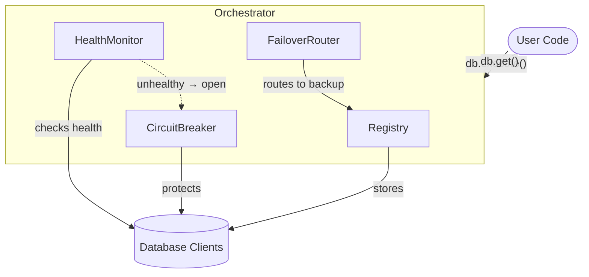
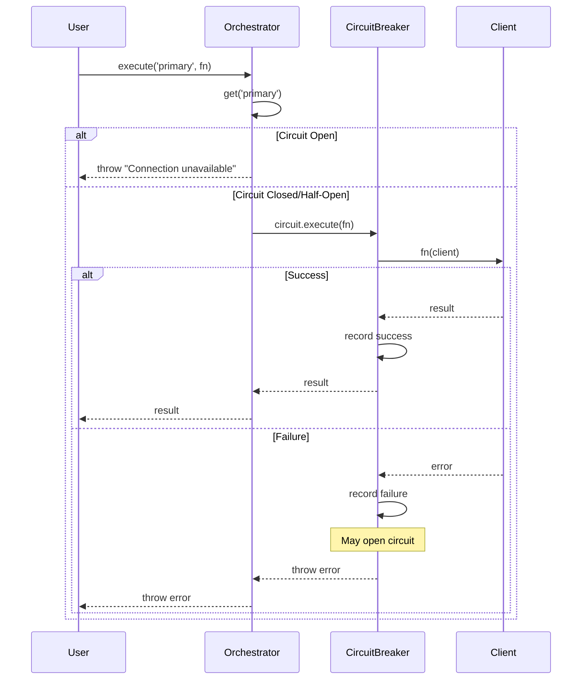
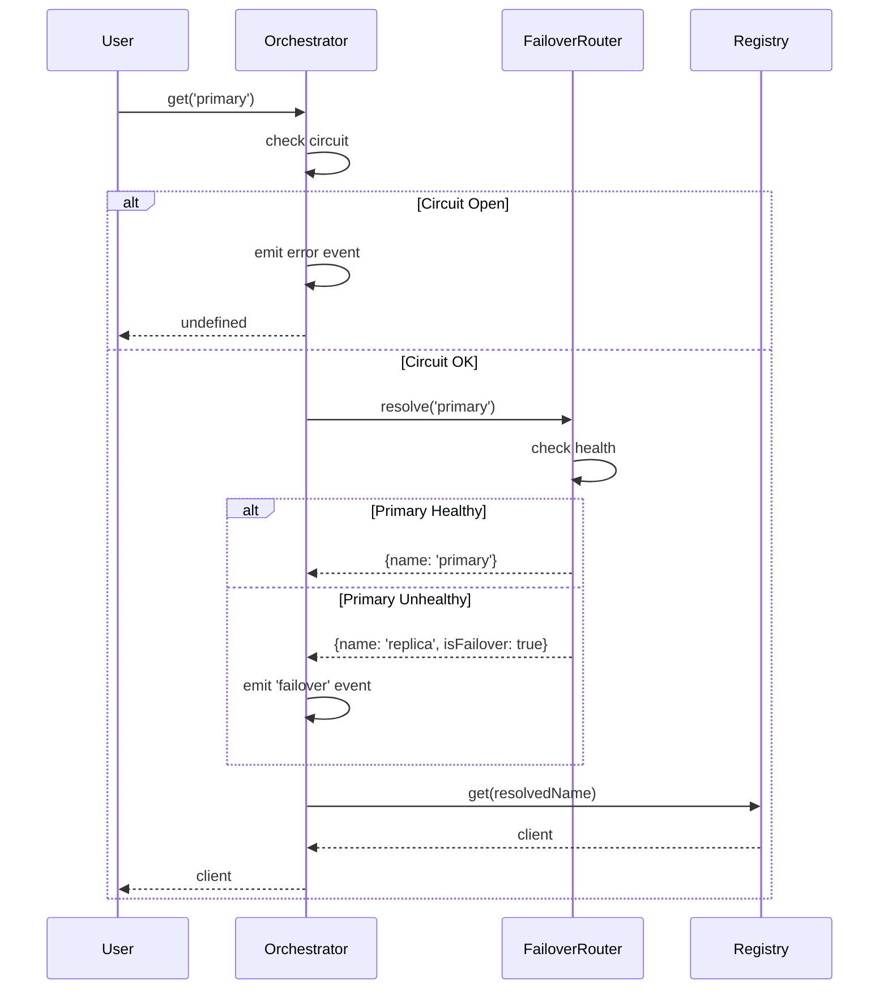

# Architecture

This document explains how OmniDB's components work together.

## Component Overview



## Component Responsibilities

| Component | Purpose | State |
|-----------|---------|-------|
| **Registry** | Store/retrieve named clients | `Map<name, client>` |
| **HealthMonitor** | Periodic health checks | `Map<name, status>` |
| **CircuitBreaker** | Prevent cascading failures | `closed/open/half-open` |
| **FailoverRouter** | Route to backup when primary fails | `Map<name, backupName>` |

---

## Execution Flow

### `db.execute(name, fn)` - Recommended



### `db.get(name)` - Manual Mode



---

## Health ↔ Circuit Integration

When HealthMonitor detects a connection is `unhealthy`:

1. **Status updated** → `health:changed` event emitted
2. **Circuit opened** → Prevents requests from piling up
3. **Event emitted** → `circuit:open` with `reason: 'health-check-failed'`

```javascript
// Internal flow (orchestrator.js#runHealthChecks)
if (newStatus === 'unhealthy') {
    circuit.open();
    emit('circuit:open', { name, reason: 'health-check-failed' });
}
```

This ensures health checks and circuit breakers stay synchronized.

---

## Error Propagation

Different components throw different errors:

| Source | Error Message | When |
|--------|--------------|------|
| `Orchestrator.execute()` | `Connection "X" is unavailable` | Circuit open, get() returned undefined |
| `Orchestrator.get()` | Throws `Error` (and emits event) | Circuit open |
| `CircuitBreaker.execute()` | `Circuit breaker is OPEN` | Direct circuit usage when open |
| User function | (original error) | Query/operation failed |

See [errors.md](./errors.md) for the complete error reference.

---

## Design Decisions

### Why `execute()` wraps `get()`
The `execute()` method calls `get()` internally to resolve the connection (handling failover logic), then wraps the user function in a circuit breaker. This provides a single entry point that handles:
- Connection resolution
- Failover routing  
- Circuit breaker protection
- Automatic success/failure tracking

### Why health checks open circuits
Without integration, you'd have contradictory states:
- Health: "unhealthy" → shouldn't use this connection
- Circuit: "closed" → requests still allowed

By opening the circuit on health failure, we ensure consistent behavior.

### Why we re-resolve failover in `execute()`
The `get()` method returns the client, not the resolved name. But we need to know which connection (primary vs backup) to record metrics against. So `execute()` re-resolves the failover to get the target name.

---

[← Previous: Configuration](./configuration.md) | [Next: Health Monitoring →](./health-monitoring.md)
